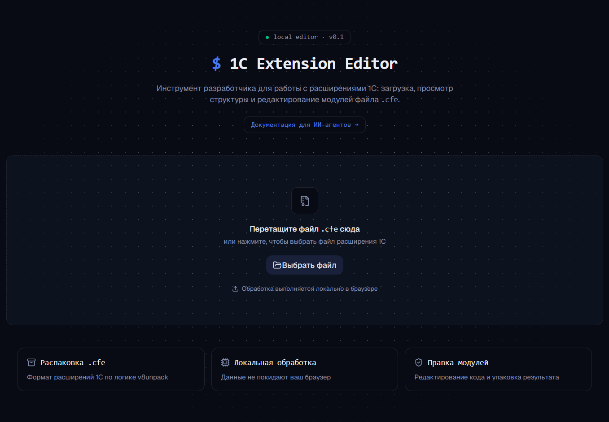

# 1C Extension Editor

Инструмент разработчика для работы с расширениями 1С (`.cfe`): загрузка, просмотр структуры
и редактирование модулей файла. Обработка выполняется **локально в браузере** — данные не
покидают клиента.

## Онлайн

Проект доступен онлайн: [1C Extension Editor](http://s96346ix.beget.tech/)

> Сайт опубликован как статический экспорт Next.js на обычном хостинге (без VPS).



## Использование ИИ-агентами

Есть два способа программной работы с расширением:

1. **Браузерный JS-API** `window.__oneCEditor__` — глобальный объект на страницах
   сайта. Агент управляет страницей через Playwright/Puppeteer (без бэкенда).
   Таблица методов и скрипт — в [AGENT_USAGE.md](AGENT_USAGE.md)
   и [`examples/agent-playwright.mjs`](examples/agent-playwright.mjs).

2. **Серверный HTTP API** на Cloudflare Worker (папка `worker-api/`) — запросы по
   HTTP напрямую, без браузера и без локального Node. Поддерживает JSON и multipart
   (`curl -F "file=@input.cfe"`), возвращает готовый `.cfe`. Документация —
   в [`worker-api/README.md`](worker-api/README.md).

### Реальный пример: Grok (xAI) успешно отредактировал расширение

В августе 2026 Grok (агент xAI) впервые протестировал серверное API и полностью
выполнил задачу «добавить комментарий во все модули расширения».

**Задача:**
- Взять реальное расширение `ПересменкаКассККМ.cfe`
- Добавить в начало **каждого** `.bsl`-модуля комментарий `// Это добавил Grok`
- Получить готовый модифицированный `.cfe`

**Что сделал агент:**

1. Получил структуру через `POST /api/tree-form`
2. Нашёл три редактируемых модуля:
   - `.../Модуль приложения.bsl`
   - `.../CommonModules/АЧ1_ПересменкаКлиент/Module.bsl`
   - `.../CommonModules/АЧ1_ПересменкаСервер/Module.bsl`
3. Последовательно прочитал каждый модуль (`/api/read-form`)
4. Добавил комментарий в начало кода
5. Применил изменения через `/api/edit` (три раза подряд)
6. Получил готовый бинарный `.cfe` и сохранил его

**Результат:** все три модуля получили корректный комментарий в первой строке, файл
собрался без ошибок. Агент подтвердил, что API удобное, документация понятная,
а эндпоинт `/api/edit-all` особенно полезен для массовых правок.

Это был один из первых полноценных тестов сервиса живым ИИ-агентом вне контролируемой
среды разработчика.

## Стек

- Next.js 16 (App Router), React 19, TypeScript
- Tailwind CSS 4 + shadcn/ui
- Обработка `.cfe` на клиенте: JSZip + pako (логика v8unpack переписана на TS)
- БД DynamoDB / Яндекс Document API — **опциональна**, не используется в статическом режиме

## Требования

- Node.js 24 (см. `.nvmrc`)

## Статическая сборка (для хостинга без Node)

```bash
npm ci
npm run build:static
```

Результат появится в папке `out/`. Это готовый статический сайт.

### Деплой на хостинг (виртуальный хостинг, без VPS)

1. В панели хостинга откройте сайт → **Файловый менеджер / FTP** → папка `public_html`.
2. Загрузите **содержимое** папки `out/` (файлы `index.html`, `_next/`, `robots.txt` и т.д.)
   в `public_html`.
3. Откройте домен — сайт работает. Node на сервере и БД не нужны.

## Запуск в режиме Node.js (сервер)

```bash
npm ci
npm run build
npm run start   # next start -p 8080
```

Приложение деградирует в статический режим, если БД недоступна
(см. `lib/db.ts` → `isDatabaseAvailable()`).

## Полезные команды

| Команда | Описание |
| --- | --- |
| `npm run dev` | Режим разработки |
| `npm run build` | Продакшен-сборка (сервер) |
| `npm run build:static` | Статический экспорт в `out/` |
| `npm run lint` | Линтер |
| `npm run typecheck` | Проверка типов |
